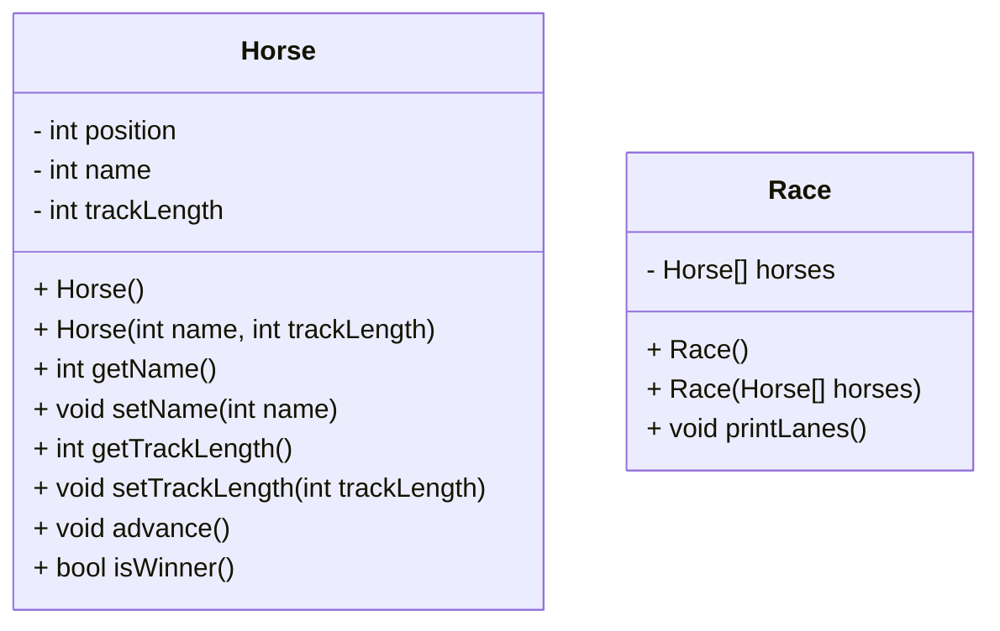

# Algorithm for OOPHorseRace
## Mermaid diagram

```mermaid
classDiagram
    class Horse {
        - int position
        - int name
        - int trackLength
        + Horse()
        + Horse(int name, int trackLength)
        + int getName()
        + void setName(int name)
        + int getTrackLength()
        + void setTrackLength(int trackLength)
        + void advance()
        + bool isWinner()
    }
    class Race {
        - Horse[] horses
        + Race()
        + Race(Horse[] horses)
        + void printLanes()
    }
```
