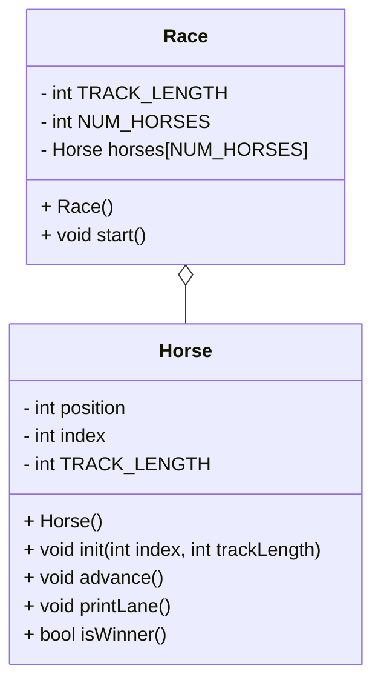

# Algorithm for OOPHorseRace
## Mermaid diagram

## Algorithm for main
1. seed random generator
1. initialize race
1. start race
1. end main

## Algorithm for race
### Header
1. private:
    1. const static int NUMHORSES = 5;
    1. initialize TRACKLENGTH to 15
    1. initialize horses array with length NUMHORSES
1. public:
    1. no-argument Race() constructor
    1. void start

### Implementation
1. Race() constructor
    1. for every horse in horses array
        1. initialize each horse with and index and the tracklength
    1. end for
1. end constructor
1. void start
    1. initialize keepGoing to true
    1. while(keepGoing)
        1. for every horse in horses array
            1. horses[i].advance()
            1. horses[i].printlane()
            1. if (horses[i].isWinner())
                1. set keepGoing to false
            1. end if
            1. print "press enter for another turn"
            1. wait for user to press enter
        1. end for
    1. end while
1. end start

## Algorithm for horse
### Header
1. private:
    1. int position
    1. int index
    1. int TRACKLENGTH
1. public:
    1. no-argument Horse() constructor
    1. void init(int index, int trackLength)
    1. void advance()
    1. void printLane()
    1. bool isWinner()
 
### Implementation
1. Horse() constructor
    1. set position to 0
    1. set index to -1
    1. set TRACKLENGTH to -1
1. end constructor
1. void init(int index, int trackLength)
    1. set index to index
    1. set TRACKLENGTH to trackLength
1. end init
1. void advance()
    1. int coin = -1;
    1. randomly assign coin either 0 or 1
    1. position += coin;
1. end advance
1. void printLane()
    1. for (int i = 0; i < TRACKLENGTH; i++)
        1. if (i == position)
            1. print horseNum;
        1. else
            1. print ".";
        1. end if
    1. end for
    1. print new line
1. end printLane
1. bool isWinner()
    1. if (horses[horseNum] >= TRACKLENGTH)
        1. print "Horse " + horseNum + " WINS!!!";
        1. return true;
    1. else
        1. return false;
    1. end if
1. end isWinner
